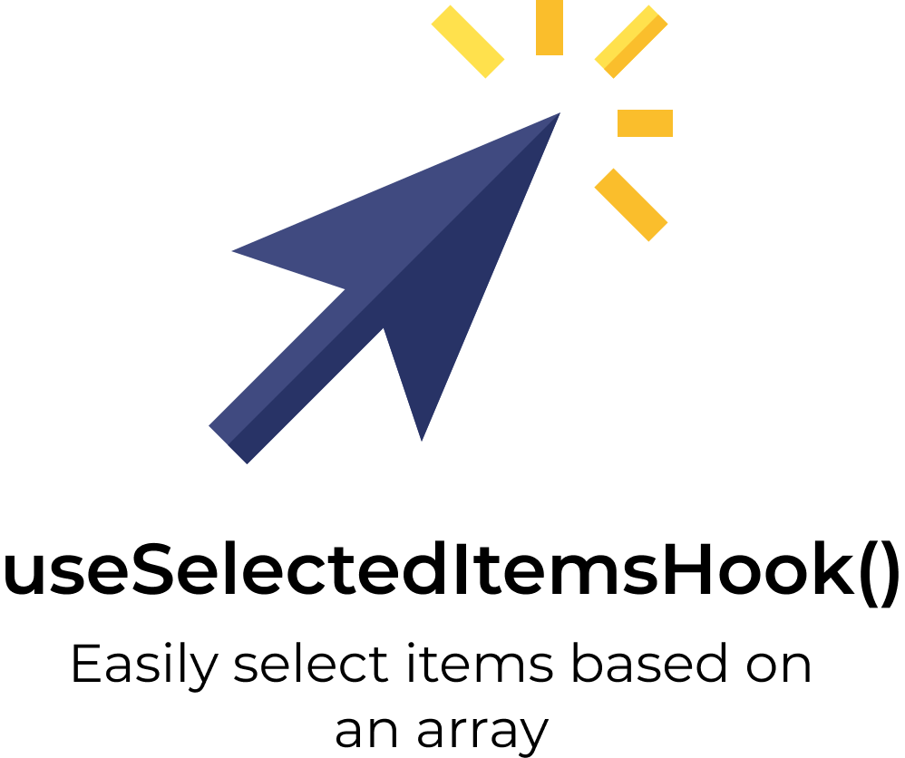

<p align="left">
   
</p>

# useSelectedItems

> Easily select items based on an array

[](https://github.com/LauraBeatris)
[](#)
[](https://github.com/LauraBeatris/use-selected-items-hook/stargazers)
[](https://github.com/LauraBeatris/use-selected-items-hook/network/members)
[](https://github.com/LauraBeatris/use-selected-items-hook/graphs/contributors)

---
<p align="center">
   
</p>

<p align="center">
   <a href="https://use-selected-items-hook-6vsdik4n4.vercel.app/">Check out the example</a>
</p>

---

# :pushpin: Table of Contents

* [Features](#rocket-features)
* [Installation](#construction_worker-installation)
* [Usage](#pushpin-goals)
* [API](#computer-api)
* [FAQ](#postbox-faq)
* [Found a bug? Missing a specific feature?](#bug-issues)
* [Contributing](#tada-contributing)
* [License](#closed_book-license)

# :construction_worker: Installation

### With Yarn

```
yarn add use-selected-items-hook
```

### With NPM
```
npm install use-selected-items-hook
```

# :pushpin: Usage

```
   const [
    selectedItems,
    listItems,
    { toggleItem },
   ] = useSelectedItems({
    itemIdentifier: "id",
    items,
  });

  const handleClick = (item) => () => {
    toggleItem(item);
  };

  return (
     {
      listItems.map((item) => {
         // You're able to apply a specify style to a selected item
         const itemClasses = classNames("cursor-pointer border-white border-solid", {
            "border-black": item.selected,
         });

         return (
            <div
               key={item.id}
               className={itemClasses}
               onClick={handleClick(item)}
            >
               <p>
                  {item.name}
               </p>
            </div>
         );
      })
   }
  )
```

As showed in the example above, you're able to pass an array of items from any type of source, as long it has a unique identifier in
order to compare the items.

# :computer: API

## useSelectedItem
```
   export type Item<T> = T & {
      selected: boolean
   };

   export interface Actions<T> {
      toggleItem: (T) => void,
      setSelectedItems: Dispatch<SetStateAction<T[]>>,
      setItemsList: Dispatch<SetStateAction<Item<T>[]>>
   }

   useSelectedItems<T>({
      itemIdentifier: string | number,
      items: T[],
   }): [T[], Item<T>[], Actions<T>];
```

The two arrays returned are the following: ``selectedItems`` and ``listItems``.

- ``selectedItems``: The items currently selected and that might be send for an API.
- ``listItems``: The items with the boolean state of ``selected``, which you're able to map and show an visual feedback.

---

The actions allow you to manipulate items.

- ``toggleItem``: Toggle the selected item, by changing the state and pushing or removing from the array.

# :postbox: Faq

**Question:** What are the tecnologies used in this project?

**Answer:** The tecnologies and libraries used in this project are [React](https://en.reactjs.org/) + [TypeScript](https://www.typescriptlang.org/) and [Immutability Helper](https://github.com/kolodny/immutability-helper) to
handle the array manipulation.

# :bug: Issues

Feel free to **file a new issue** with a respective title and description on the the [useSelectItems hook](https://github.com/LauraBeatris/use-selected-items-hook/issues) repository. If you already found a solution to your problem, **I would love to review your pull request**! Have a look at our [contribution guidelines](https://github.com/LauraBeatris/use-selected-items-hook/blob/master/CONTRIBUTING.md) to find out about the coding standards.

# :tada: Contributing

Check out the [contributing](https://github.com/LauraBeatris/use-selected-items-hook/blob/master/CONTRIBUTING.md) page to see the best places to file issues, start discussions and begin contributing.

# :closed_book: License

Released in 2020
This project is under the [MIT license](https://github.com/LauraBeatris/use-selected-items-hook/master/LICENSE).

Made with love by [Laura Beatris](https://github.com/LauraBeatris) 💜🚀
